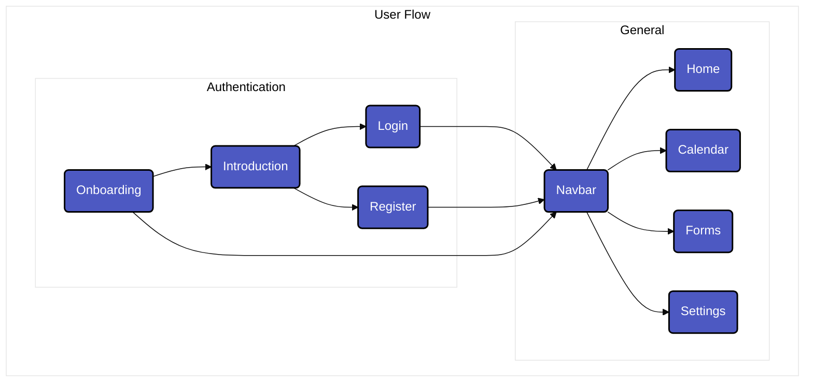
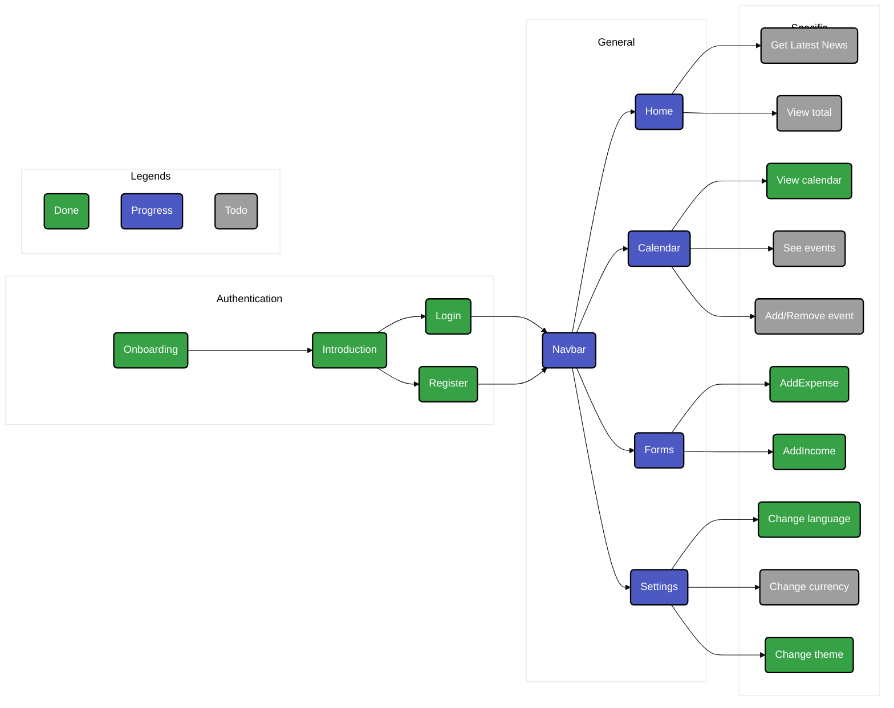

# Expense Tracker

## Description

Expense tracker is for now a simple open source and free mobile app designed to follow your expenses and incomes for your personnal comfort and information.

The frontend part is built in dart/Flutter then converted to natives langages like Swift, Kotlin, Javascript, etc.

The backend part is built in PostgreSQL for the database and Python for the API.

### Features

### Support

- [x] iOS
- [ ] Android
- [ ] web
- [ ] Windows
- [ ] Linux
- [ ] MacOS

### i18n

- [x] English
- [x] French
- [ ] Others

## Installation

No content for the installation yet.
